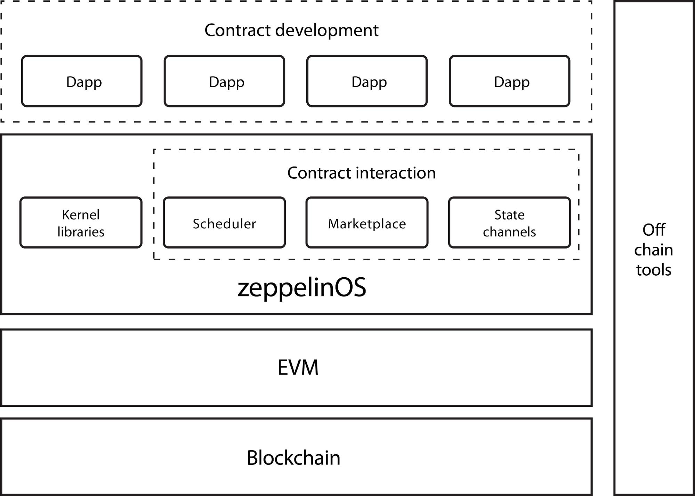
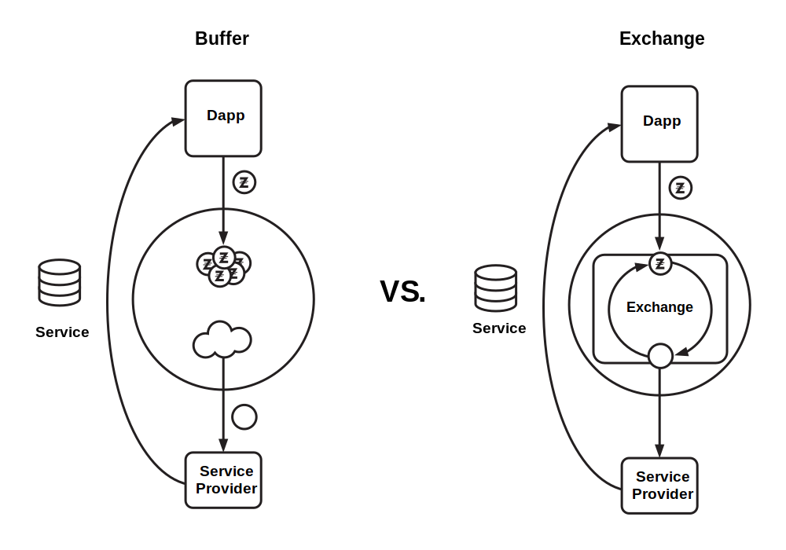

# Introduction

Anyone can use open networks like Ethereum to run software and formalize
contractual relationships through code. These decentralized applications
often facilitate some kind of financial exchange for services. However,
the development process to build this kind of software is often complex,
time-consuming, and prone to error.

Ensuring the security of these financial transactions and the funds held
in smart contracts is imperative to the success of the blockchain
ecosystem. There is currently little standardization and no easy way to
develop highly secure applications. Responding effectively to security
emergencies is beyond challenging with current tools.

On the other hand, decentralized networks are not structured to work
together, often needing access to each other's native tokens to operate,
making it hard to leverage external systems.

To address these issues we propose zeppelin\_os: an open-source,
decentralized platform of tools and services on top of the EVM to
securely build and manage smart contract applications, free of charge.

# Core systems overview

## Vouching

In the context of zeppelin\_os, governance refers to the action of
upgrading or patching Kernel code. This is achieved with a vouching
mechanism where network participants can lock up ZEP tokens to vouch for
a new version of the Kernel. Upgrading to a new version is free, so this
vouching mechanism is primarily a way for the network to indicate the
latest, most-qualified version of the Kernel while rewarding contributors
with a portion of the staked tokens.

## Kernel

The Kernel is the foundation layer of zeppelin\_os. Existing as a smart
contract library deployed on the blockchain, it provides a set of basic
functionality and services for smart contracts that use the operating
system. It is supported by a decentralized upgrading mechanism powered
by the vouching mechanism governed by ZEP token holders. The
upgradeability mechanism of the zeppelin\_os Kernel will be based on the
proxy library pattern\ [\[1\]][proxylibs] developed in joint
collaboration between Zeppelin and Aragon. Developers will not have to
spend ZEP tokens to use the Kernel functionality, it will be available
free of charge.

[proxylibs]: https://blog.zeppelin.solutions/proxy-libraries-in-solidity-79fbe4b970fd

The goal for the zeppelin\_os Kernel is to provide a set of functions
for the smart contracts that run on top of it, requesting services from
the OS rather than re-implementing them from scratch. This library of
reusable contracts and functions will be heavily inspired by
OpenZeppelin\ [\[2\]][openzeppelin], and held to the same security
standards.

[openzeppelin]: https://openzeppelin.org

Examples of things developers will be able to do with these libraries
include:

-   Create and customize an ERC20 Token.

-   Create a capped, refundable, and/or whitelisted crowdsale contract.

-   Create a trustless bug bounty.

-   Create pausable, ownable, and balance-limited contracts.

-   Set up a token vesting or token locking contract.

-   Create trustless token sale or token purchase contracts.

-   Create atomic token swap contracts.

-   Create a token future contract.

{width=60%}

## Marketplace

Much as traditional mobile app marketplaces act as central hubs for
mobile users to browse and purchase available services, one of the
central features of zeppelin\_os is a marketplace for smart contracts,
where services can be purchased and integrated into other applications.

Today the majority of interactions with smart contracts are triggered by
people. We believe that for the industry to grow, smart contracts need
to start talking to each other. The interaction with such services will
be facilitated through different standard execution models powered by the
OS, and payments executed with the platform's ZEP tokens, thus enabling
an effective in-OS economy between service providers and their client
applications. This model would allow, for example, any smart contract to
store data both in Filecoin and Storj at the same time, without the need
to use either's native token, paying both with ZEP.

Though smart contracts are currently quite limited in their interactions
with the off-chain world, the advent of services that provide the bridge
to execute off-chain effects can offer true decentralized applications the
power to run entirely on zeppelin\_os. Examples of such services are
file storage, mail sending, push notifications, off-chain intensive
computation, machine-learning services, etc.

## Software Development Kit

As an addition to the on-chain services offered by zeppelin\_os, the
platform will provide a set of off-chain tools aimed at simplifying the
development, debugging, testing, deployment, and monitoring of
decentralized applications. We intend to raise the quality and security
bar of smart contracts by accelerating the professionalization of the
industry. We will lead the creation of the well-known tools that already
exist for traditional centralized software such as continuous
integration systems, static code analysis, and health monitoring.

# Security Model

Being a layer that smart contract applications interact with on-chain,
we open up the possibility of seamlessly delivering upgrades to
zeppelin\_os users. This enables rolling out security mitigations and
patches as soon as a vulnerability is found, instantly protecting all
users of zeppelin\_os.

Users of the Kernel libraries will have the option to enable automatic
upgrades. For instance, users may specify that they use version \^1.2,
meaning the most-vouched version among 1.2 and above, but below 2.0.

These upgrades are optional for Kernel users, as they may choose to
switch manually to 1.3 after reviewing the new version themselves,
regardless of the vouching of that version.

The upgrading system will be incentivized for ZEP holders to review
patches and vouch for their correctness. A reviewing mechanism is
necessary to avoid the possibility of a centralized party upgrading
(i.e. changing) all contracts using the optional automatic upgrade
system in the OS without any control from the community, while providing
a mechanism of fast response in the event of a critical security issue
if it is acknowledged by the majority.

Experience has shown that bugs will always be found in a codebase. As
smart contracts become more complex, the probability of bugs becomes
larger\ [\[3\]][schneier], and with it comes a greater possibility of attack.

[schneier]: https://www.schneier.com/essays/archives/1999/11/a\_plea\_for\_simplicit.html

To prepare, zeppelin\_os will provide users a toolbox for attack
response. Triggering an emergency pause, reverting to a previous
uncompromised state, or forking a contract are some of the
possibilities.

{width=70%}

# Incentives and governance

Crypto-economic protocols create financial incentives to drive a network
of rational actors to coordinate their behavior towards a common goal.
Often, the alignment of incentives is achieved by introducing a native
token. In the case of zeppelin\_os, the native token is ZEP, and its
goal is to align network incentives to establish, grow, and maintain an
ecosystem for easy development of secure decentralized applications.

Conceptually, there are two distinct actions a Kernel user can perform
with regards to the upgrade mechanism:

1)  To change their contract's used kernel version from $V$ to $V_0$.

2)  To signal their approval or willingness to use $V_0$ over $V$.

Given 1) is very hard (or impossible) to tie into token mechanics
without forcing developers to hold ZEP tokens to use the Kernel, we will
use 2) as a proxy of 1). To do so, we define the following "vouching"
mechanic: ZEP token holders can signal their approval for a specific
Kernel version $V$ by locking part of their tokens and specifying which
version they vouch for. It is worth noting that the Kernel is upgraded
as a monolithic system and individual components are not upgraded in a
modular fashion, although this may be subject to change in the future.

Locking tokens simply means the user cannot transfer or vouch other
versions with those same tokens. This does not mean tokens are locked
for a specific amount of time.

For example, given a Kernel with only versions v1.0.0 and v1.0.1, and 3
token holders with 100 ZEP tokens each, the following situation can
occur:

-   Holder A vouches for v1.0.0 with 50 ZEP tokens and v1.0.1 with 50
    ZEP tokens.

-   Holder B does not vouch for any version.

-   Holder C vouches for v1.0.1 with 80 ZEP tokens.

In this example, if holders ABC make up a majority of vouching power in
the network, the new version 1.0.1 would be considered the latest
version accepted by the network, in the context of automatic upgrades.
It is important to note that users can manually change the Kernel
version their contracts use, making upgrades of the Kernel opt-in.
zeppelin\_os will also provide tools for contracts to automatically
upgrade based on a policy set by the developer.

## Development Bounties

In order to guide the development of the zeppelin\_os Kernel and
incentivize contributors to begin working on an issue, the OS will
provide a platform for development bounties. In it, users can post their
desired features and place an upfront bounty for them. The same can be
done for bugs that need to be fixed. The aim is for bounties to act as a
driving force for the development of the Kernel and a motivation for
developers, in addition to the usual reward that comes with the
community vouching an already released version. We aim to implement a
delegated review process for development bounty proposals, but
initially, this process will be managed in a centralized manner.

As an end-to-end example of this process, think of a developer that is
building a project on top of the zeppelin\_os Kernel who needs a type of
smart contract that has not been built yet. Through the platform, they
can post a bounty of a given amount of ZEP tokens for its development.
Other developers might share the need for the feature, and can add their
own bounty on top. A developer can see this bounty and announce that
they're working on the feature. Once it is finished, a network delegate
will review the submission. If the feature implementation is acceptable,
the bounty will be released to the developer and the feature will be
submitted for normal Kernel upgrade vouching. A small cut will be
rewarded to the reviewer.

#### Considerations and Pending Challenges {.unnumbered}

-   Specifics of the voting process for choosing network delegates are
    still undecided. Most likely, this will be a staking
    system, where each token holder has a right to lock up
    tokens and thus give their vote for a specific delegate/reviewer.

-   The incentives of the reviewer are easily misaligned with the
    network as the reviewer should be rewarded for every review,
    regardless of if the proposal is accepted or not. This creates an
    incentive for the reviewers to create large amounts of proposals
    that will be declined as the reviewer would still receive the
    reward, depleting the developer bounty pool.

## Mechanics

The following mechanics govern the Kernel upgrade mechanism and
incentives.

Any developer can propose a new Kernel version upgrade based on a
previously existing version. Creating this new version proposal has a
cost in ZEP tokens as a way to prevent denial-of-service attacks related
to proposal submissions. Compensation to the developer of a Kernel
version is a function of the amount of tokens vouching for that version.
When a developer proposes a new version of the Kernel building upon a
previous version, users can stop vouching for the previous version in
favor of the new one. Multiple versions of the Kernel can exist in
parallel, creating a sort of tree structure for versions.

Each of these vouching operations will compensate the new version's
developer according to a function of tokens vouched.

$\mathsf{change\_vouching}(v_1, v_2, n)$ will trigger a $\mathsf{payout}(v_2, f(n))$,
where $f$ is monotonically increasing over $n$, the amount of tokens.
Payouts may also include a time-lock or other additional safety measures
to ensure incentives are aligned.

Whenever a user vouches for a new version with t tokens, a fraction of
those tokens is sent to the developer as a reward. This causes
$\mathsf{change\_vouching}(v_1, v_2, n)$ to take $n$ tokens from $v_1$, give
$f(n)$ to the developer, and lock $n - f(n)$ for $v_2$, where
$f(n) = n * (1/k)$ where $k$ is a natural number. This definition
of $f$ does not depend on total vouching tokens. This means the payout
is a fraction of the moved tokens, coming out of the voucher's balance.
Tokens given as reward to the developer have a time lock and are only
redeemable after a certain token amount threshold is met. During this
lock-in period, vouchers may decide to change their target version.

An example timeline of vouching changes would look like this:

\begin{longtable}[]{@{}llll@{}}
\toprule
  & \multicolumn{3}{c}{Vouch \% over time} \tabularnewline\cmidrule{2-4}
\begin{minipage}[t]{0.1\columnwidth}\centering\strut
{Version}\strut
\end{minipage} & \begin{minipage}[t]{0.1\columnwidth}\centering\strut
{$t_0$}\strut
\end{minipage} & \begin{minipage}[t]{0.1\columnwidth}\centering\strut
{$t_1$}\strut
\end{minipage} & \begin{minipage}[t]{0.1\columnwidth}\centering\strut
{$t_2$}\strut
\end{minipage}\tabularnewline \midrule
\begin{minipage}[t]{0.1\columnwidth}\centering\strut
{1.6.3}\strut
\end{minipage} & \begin{minipage}[t]{0.1\columnwidth}\centering\strut
{20}\strut
\end{minipage} & \begin{minipage}[t]{0.1\columnwidth}\centering\strut
{20}\strut
\end{minipage} & \begin{minipage}[t]{0.1\columnwidth}\centering\strut
{20}\strut
\end{minipage}\tabularnewline
\begin{minipage}[t]{0.1\columnwidth}\centering\strut
{2.0.1}\strut
\end{minipage} & \begin{minipage}[t]{0.1\columnwidth}\centering\strut
{80}\strut
\end{minipage} & \begin{minipage}[t]{0.1\columnwidth}\centering\strut
{70}\strut
\end{minipage} & \begin{minipage}[t]{0.1\columnwidth}\centering\strut
{0}\strut
\end{minipage}\tabularnewline
\begin{minipage}[t]{0.1\columnwidth}\centering\strut
{2.0.2}\strut
\end{minipage} & \begin{minipage}[t]{0.1\columnwidth}\centering\strut
{0}\strut
\end{minipage} & \begin{minipage}[t]{0.1\columnwidth}\centering\strut
{10}\strut
\end{minipage} & \begin{minipage}[t]{0.1\columnwidth}\centering\strut
{80}\strut
\end{minipage}\tabularnewline
\bottomrule
\end{longtable}
                                                        
-   At time $t_0$, version 2.0.2 is released fixing a vulnerability in
    version 2.0.1.

-   At time $t_1$, a user with 10\% of the total vouching power moves
    their tokens from 2.0.1 to 2.0.2 ($\mathsf{change\_vouching}(2.0.1, 
    2.0.2, 10)$) which results in a compensation to the
    developers of 2.0.2 ($\mathsf{payout}(2.0.2, f(10))$).

-   At time $t_2$, the other user of 2.0.1 moves their tokens to 2.0.2,
    and this results in the compensation to the developers
    ($\mathsf{payout}(2.0.2, f(70))$).

## Rewards

We acknowledge that it is impossible to measure the value of a
contribution other than subjectively by the users of the OS. A change as
small as a single character can save millions of dollars, while a very
large changeset adding multiple contracts could be useless. There is no
objective way of measuring this from the code itself, only by how many
users adopt the changes.

As such, and as a result of the mechanics proposed above, each proposed
upgrade is rewarded equally, given the same amount of tokens vouching
for it. This will cause the developers proposing upgrades to adapt each
of their contributions to the expected reward, and the market will
determine whether the payout is fair by either vouching or not for the
contribution.

For instance, if the proposed upgrade is too small in terms of
value-added, the token holders will refrain from vouching for it, as the
payout to the developer would be unfair. This will prevent developers
from upgrade spamming, and incentivizes them to band together to submit bigger
contributions encompassing several small changes, with a payout address
set to a fund-splitting contract.

Also, note that any damage done by malicious actors in the system is
contained. Developers vouching for their own versions would end up
losing tokens due to the associated costs of proposing new versions and
the tokens paid as part of the change vouching operation. Malicious
users vouching for buggy versions, as an attempt to introduce
vulnerabilities in the Kernel, will not be followed by other users who
will vouch for a different version in the development tree.

All in all, since the motivation for vouching users is to maintain a
healthy development cycle of the OS and ensure the security of the
underlying Kernel libraries, we expect each vouching operation to be
done towards this end, regardless of the small number of tokens deducted
from the user's balance upon vouching.

# Kernel

## Standard Library

zeppelin\_os will provide an on-chain standard library of reusable
contracts and functions. The goal for the zeppelin\_os Kernel is to
provide a set of functions to act as system calls for the smart
contracts that run on top of it, thus requesting services from the OS
rather than reimplementing them. Smart contracts building on the OS will
call into this library.

## Contract Upgradeability

In addition to having upgradeability of the zeppelin\_os Kernel itself,
the underlying implementation will be made available to users of the OS
to enable upgradeability of their own smart contracts. This allows
rolling out contract-specific security patches, as well as the
progressive deployment of features.

## Scheduler

Contract code execution is synchronous and linear, having the
possibility to call other contracts but restrained to a single and
contiguous execution thread. To support more complex operations,
applications require off-chain infrastructure, defeating the very purpose
of fully decentralized applications.

As a means to support richer execution models, the OS will provide,
through the usage of a standardized set of signaling events, a
bounty-based smart contract async execution scheduler. In it, different
parties can offer to execute async operations and securely call back into
the contract to resume operations. This also opens the way to standard
mechanisms for requesting data from trusted and authoritative sources by
adding a validation on the callback originator to ensure the response is
provided by a secure oracle.

In order to accomplish this, the OS will define the required standards
and provide code for simplifying their adoption, for both the scheduler
clients and the providers who wish to offer the execution of async
operations, effectively setting up nodes that power the distributed
scheduling network.

## Messaging Library

The OS will provide various mechanisms for inter-contract communication
and networking, such as publish-subscribe messaging, message queues, and
shared storage.

Though decentralized and secure, blockchain transactions are limited in
frequency and cost by block mining times and fees. This caused the
emergence of alternate off-chain transaction systems that could be
consolidated back to the blockchain after multiple operations, with
State Channels\ [\[4\]][statechan] being one of the latest proposals for
intercommunication between two or more peers, verified and consolidated
by a smart contract acting as a judge.

[statechan]: http://www.jeffcoleman.ca/state-channels

The OS will offer State Channels support through common protocol specs
and reference implementations, plus all the on-chain infrastructure
necessary for discovery, arbitration, and consolidation of state
channels. Besides providing a cheaper communication mechanism, this also
leaves the door open for future direct integration with off-chain state
payment networks in the platform.

## Trusted Oracles

The OS will provide a standard interface to access, from a smart
contract, information on the blockchain currently unavailable from
on-chain apps, such as current ETH price, gas price, transaction pool
size, average mining block times, etc.

# Marketplace

The zeppelin\_os marketplace creates a plug and play experience for the
developer when integrating various protocol services into a
decentralized application. Without it, if a developer wants to utilize
more than one protocol's service they would need to provide exchange
functionality.

Applications built on zeppelin\_os may include one or more external
protocols via the marketplace. As the native token ZEP is used to
operate applications built on the platform, there needs to be a
mechanism by which the proxy for an external protocol converts ZEP into
whichever token is required to use the external protocol. The
marketplace thus needs to have some kind of exchange mechanism. We
propose three different methods that we're experimenting with to achieve
this, all of which are explored below.

## Exchange

This method is relatively simple in that it does not require the
developer of a marketplace integration to apply funds to ensuring the
functioning of their application. The exchange method would utilize
existing exchange infrastructure to manage conversions between ZEP and
other tokens.

Each protocol providing services through the marketplace would connect
to a zeppelin\_os exchange integration allowing for the conversion of
ZEP into other protocol tokens. In the future, competitive mechanics can
be added to the exchange process by creating a mechanism for exchanges
to compete for any given transaction. If opened up to the market,
traders could provide this service and benefit from the spread
attainable by performing market making operations.

## Buffer

The second option for providing marketplace exchange, this time without
using an actual exchange, requires the developer delivering a service
through the marketplace to load tokens of the external protocol to a
smart contract, creating a buffer. These tokens will be used to pay for
protocol services as users pay for services in the application using
ZEP. The smart contract will have an oracle which dictates the exchange
rate for converting ZEP to the external token. The developer then
receives ZEP and spends the external tokens. The developer of the
integration thus functions like a market maker.

This method may require the developer of an integration to hold
significant amounts of the protocol token, which is not ideal for
keeping barriers to entry low. However, this method would enable real
time exchange and also allow the developer of the integration to charge
a spread on the exchange to generate revenue. Eventually such a spread
would decrease to the lowest point where it makes sense to provide such
a service. On the user side, this competitive tendency to lower cost,
will lead to the best achievable prices over time.

## ZEP-based Economy

The third option would be for the developers who want to provide
services through the marketplace to allow their smart contracts to
receive payments denominated in ZEP. Prices would still be set in the
service's native token, but the payment would be delivered as the
equivalent value in ZEP, making this another truly real time option,
without the need to stock a significant amount of tokens in a buffer.

### Considerations and Pending Challenges {.unnumbered}

-   The exchange method suffers the same latency and scalability
    problems of any on-chain exchange.

-   The ZEP-based solution requires the developers providing services
    through the marketplace to modify their smart code to accept ZEP,
    so the barrier to entry is high for existing projects.

-   The buffer method requires the developer of the marketplace
    integration to hold some amount of the respective protocol's
    tokens, possibly increasing barriers to entry.

{width=70%}

## Marketplace Curation

All submissions to the marketplace will be carefully reviewed to ensure
the highest quality and security. Initially this review process will be
conducted by the Zeppelin Solutions\ [\[5\]][zeppelinsolutions] team,
along with a public review with a bug bounty. A centralized marketplace
review has benefits in terms of maintaining quality of contents and
efficiency of the review process, but history tells us it also allows
the controlling party to exert non-competitive influence\ [\[6\]][apple]
We understand this problem and are fully committed to transitioning into
a decentralized review model once the most suitable model is found.

[zeppelinsolutions]: https://zeppelin.solutions
[apple]: http://newsvote.bbc.co.uk/1/hi/technology/7002612.stm

### Considerations and Pending Challenges {.unnumbered}

Decentralizing marketplace review needs to be efficient, scalable and
maintain a high quality of accepted submissions. This can potentially be
achieved using a delegation model, where the delegates are incentivized
to review submissions and act along guidelines voted on by the
community.

# Software Development Kit

## Analytics \& Monitoring

Contract transactions and events provide invaluable insight on the usage
of a deployed application, analogous to end-user actions and events
performed on a web page. As such, an off-chain analytics dashboard can
aggregate on-chain generated contracts events for research on their
usage. Also, by tracking from which node each transaction is originated,
it is possible to obtain information on how end-users actually connect
to the network to interact with the contracts.

The other side of tracking contract-generated events and transactions is
monitoring the health of each contract, by keeping record of the
transaction error rate and failure-associated events, thus triggering
alerts through both general and per-contract defined rules.

## Continuous Integration for Contracts

Automated testing through continuous integration providers has become a
standard in the software industry, as a means to increase the confidence
on the project health by checking its tests in a separate environment at
every stage of development. However, this requires a testing environment
with conditions as similar as possible as the production one. As such,
zeppelin\_os will provide the required services for effectively testing
smart contracts and their interactions with other services in a
continuous integration fashion, including replayability of previous
transactions using the updated codebase to compare generated outcomes.

## Automated Code Analysis

Static analysis is a long-running research field in academia, with
occasional ports to industry-level tools, despite its enormous benefits
towards the assurance of correctness and its ability to identify
potential bugs. Given the high security requirements of decentralized
applications, applying these strategies to smart contracts code is a
must, and an area to be continuously researched and improved.

Having access to the code powering the smart contracts applications,
zeppelin\_os shall offer automated code analysis services with
increasingly powerful rules and techniques, preventing inadvertently
deploying potentially unsecure code, and alerting owners of existing
running contracts of newly found vulnerabilities.

## Heroku\ [\[7\]][heroku] for Decentralized applications

[heroku]: https://heroku.com

In order to simplify the deployment process for unsophisticated users,
the platform will provide the necessary open-source development tools to
facilitate the specification of high-level interaction rules between
smart contracts that are then executed on-chain. Submitting the rules to
the platform will trigger a testing and analysis process, described in
the previous sections, which will be followed by an actual deployment to
the blockchain, or an upgrade powered by the aforementioned mechanisms,
thus minimizing the devops complexity of dapps for programmers.

The Platform as a Service approach also includes acting as a one-stop
platform for integration with other contracts, providing a user
interface for the discovery and management of marketplace-offered
services, so dapp owners can plug-and-play different infrastructure
building blocks. Like IFTTT\ [\[8\]][ifttt] recipes for smart contracts.

[ifttt]: https://ifttt.com

\clearpage

# References {.unnumbered}

\begin{enumerate}[label={[\arabic*]},itemsep=0.4\baselineskip]
\item Manuel Araoz, Jorge Izquierdo. Proxy Libraries in Solidity. \url{https://blog.zeppelin.solutions/proxy-libraries-in-solidity-79fbe4b970fd}

\item OpenZeppelin. \url{https://openzeppelin.org}

\item A plea for simplicity. \url{https://www.schneier.com/essays/archives/1999/11/a_plea_for_simplicit.html}

\item State channels. \url{http://www.jeffcoleman.ca/state-channels}

\item Zeppelin Solutions. \url{https://zeppelin.solutions}

\item Time for Apple to face the music? \url{http://newsvote.bbc.co.uk/1/hi/technology/7002612.stm}

\item Heroku. \url{https://heroku.com}

\item IFTTT. \url{https://ifttt.com}

\item Ethereum. \url{https://ethereum.org}
\end{enumerate}
